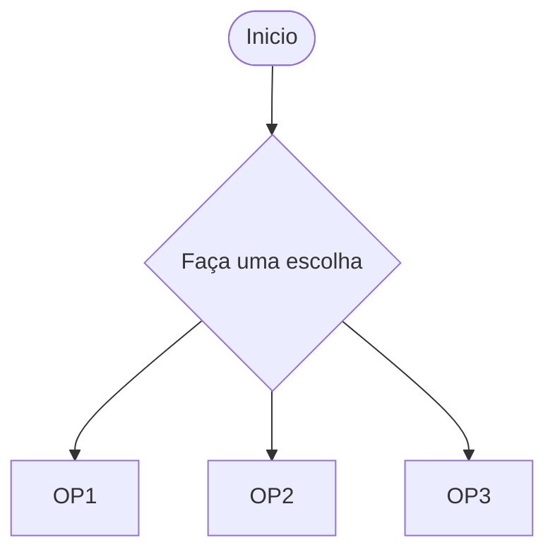
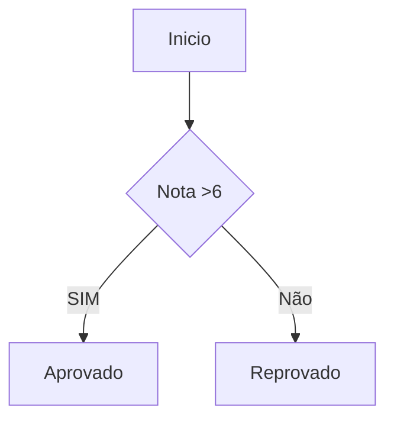
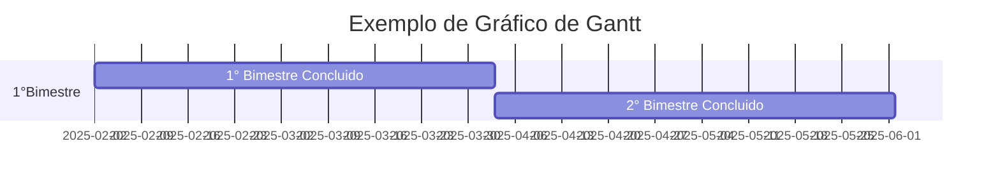

```mermaid
flowchart TD

  A(["Inicio"])
  A --> B{"Faça uma escolha"}
  B --> C["OP1"]
  B --> D["OP2"]
  B --> E["OP3"]
```

```mermaid
graph TD;
  A[Inicio] --> B{Nota >6};
  B --> |SIM| C[Aprovado];
  B --> |Não| D[Reprovado];

```

```mermaid
gantt
  title Exemplo de Gráfico de Gantt
  dateFormat YYYY-MM-DD
  section 1°Bimestre
  1° Bimestre Concluido:a1, 2025-02-02, 60d
  2° Bimestre Concluido:a2, after a1, 60d
  section 2°Bimestre

```
